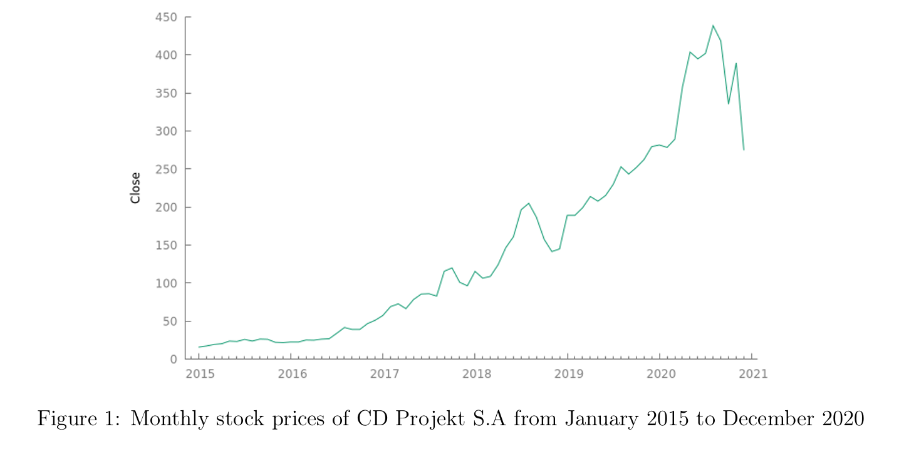
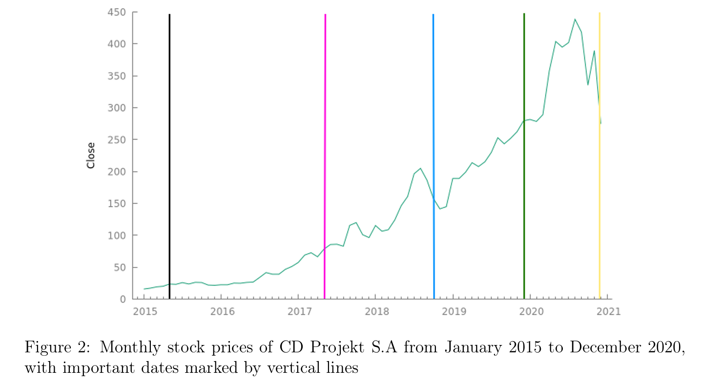
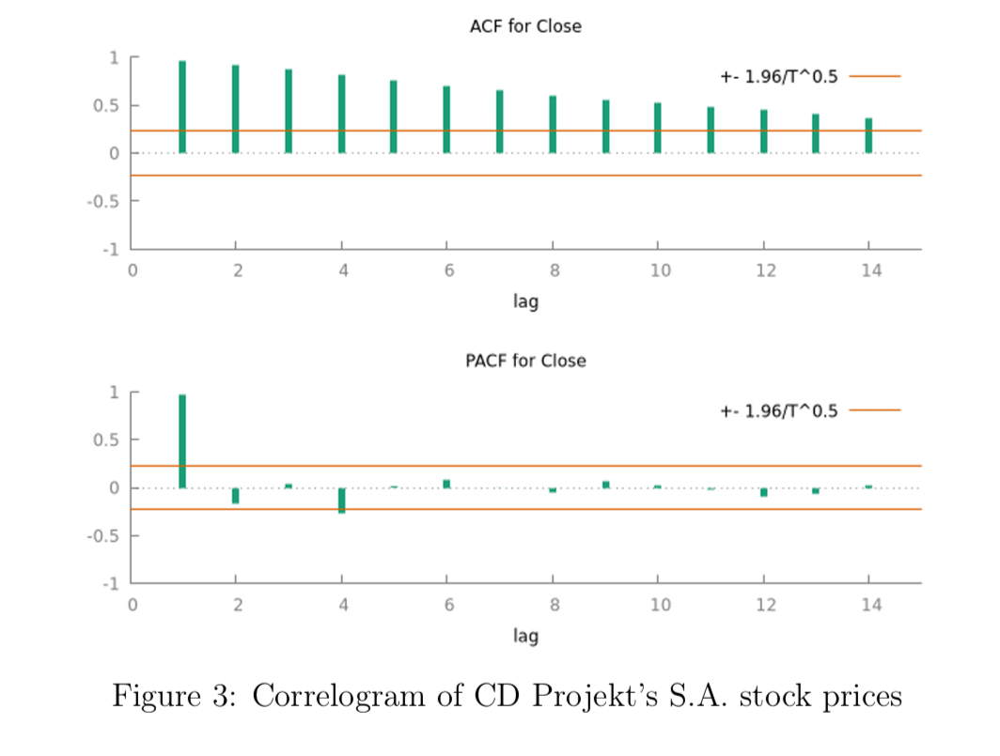
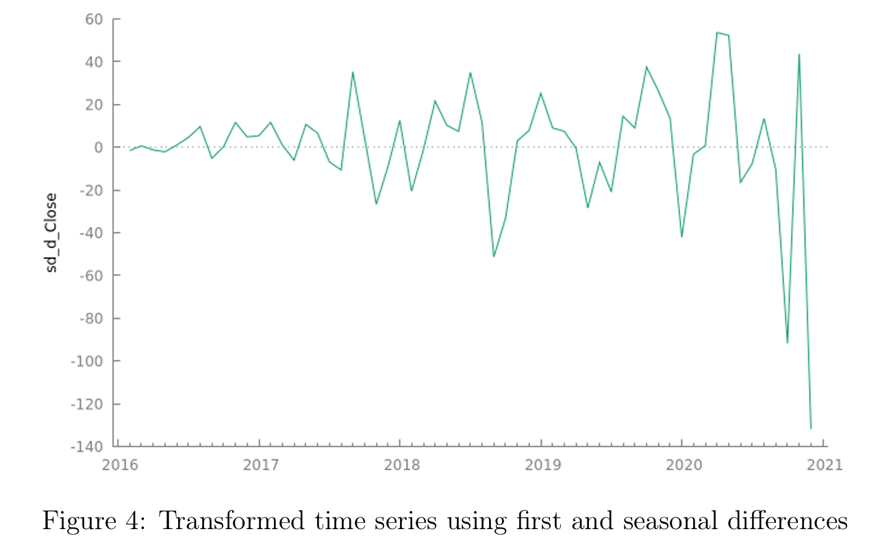
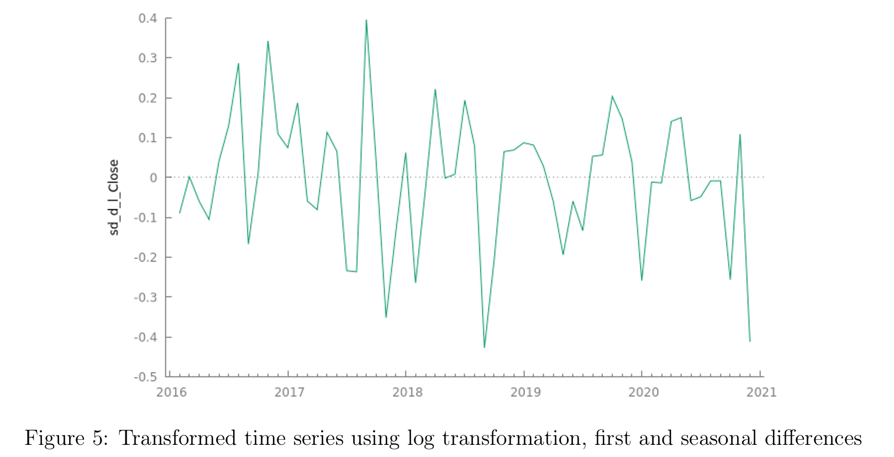

## 1. Introduction

While studying, I got really into data analysis - especially time series. This project is one I worked on using GRETL, where I used ARIME and SARIMA models to forecast sales.It was a great way to turn theory into something more hands-on and actually see how those models work in practice.

Feel free to check it out and see what insights I found!

## 2. Abstract

In this project my main goal is to use time series of interest to analyze and forecast. I have chosen monthly stock prices of a Polish video game developer, publisher and distributor CD Projekt S.A. Firstly, I will introduce data and tell a little bit about important dates which were affecting this time series. Later I will conclude if this time series can be considered as a representation of stationary process. Next I will analyze correlogram and also use automatic criteria in order to identify test models. Then I will estimate those models using the training set and also check them, that is establish if residuals of those models can be considered as a realization of white noise process and also I will check whether the residuals are normally distributed or not. Finally I will forecast using those models and I will compare them to the real values of the test set. At the end I will summarize my observations

## 3. Introducing the data
Let’s first have a look at our data. This series is containing monthly stock prices of CD Projekt S.A. from January 2015 to December 2020. The currency of those prices is in Polish currency PLN. PLN to EUR converter is 0.22 on the day 20 January 2021.

The company was founded in May 1994 by Marcin Iwiński and Michał Kiciński, but it debuted only in 2011 on the stock market as a result of collaboration with Optimus (the computer business which was on a verge of bankruptcy). The years before 2015 were 1 not the best for the company and the prices remained practically at the same very low value ( 7.00PLN). That’s why I am considering this time series starting from January 2015, because this is the most interesting period to analyze.

On May 2015 the company released The Witcher 3: Wild Hunt based on the book series made by Andrzej Sapkowski. But only after one year the company began to record growth. So what happened later? In May 2017 Netflix officially declared new series taking place in The Witcher world. The announcement of the series triggered an increase in the company’s stock prices, while after the announcement of the official cast (in October 2018), prices began to fall. It was related to the controversy surrounding the actors who, according to the fans, did not fit into the world created by Andrzej Sapkowski. However, after the series premiere, which was in December 2019, the company’s shares were still going up. In the December 2020 after releasing the most important game that was awaited by the whole gaming world, Cyberpunk 2077, prices fell sharply. Widespread criticism concerning technical underdevelopment, that caused numerous errors, despite many pre release assurances that a full-fledged product will be available on the market, caused the shake throughout investors.

The plot below contains those important dates.

Let’s now concentrate on analyzing our time series using tools that I learned during the course. Firstly, I will consider whether this time series is a representation of a stationary process or not.

## 4. Stationary process or not?

Looking at the plot of our time series we can conclude that this clearly is not a representation of a stationary process. There is a trend and also by looking at the correlogram of this time series we can see that.

So now what we need to do is to transform it in a way to get the stationary process. I have decided to consider this time series as a seasonal time series because during forecast I obtained better forecasts when I removed seasonal component. My first attempt to obtain stationary process was using first difference of my observed values and then the seasonal difference. But although the expected value was 0, the variance was not constant. The plot below shows this result.

Clearly, in the above plot we can see that the variance is increasing over time. That’s why now I am using log transformation to stabilize it and then both first and seasonal differences.

In this situation we can see that the mean is equal to 0 and we can assume that the variance is more or less constant. That’s why now, after all the transformations, this time series can be considered as a representation of a stationary process. So now we will consider correlogram of that transformed time series and also we will use automatic criteria in order to conclude test models.
