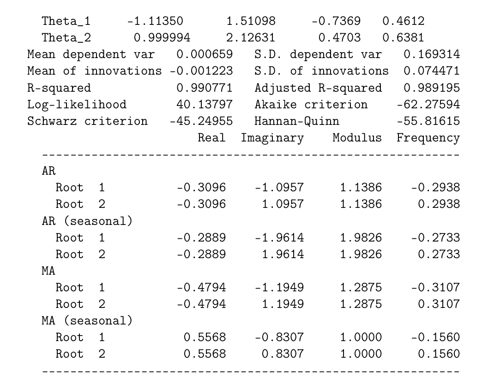
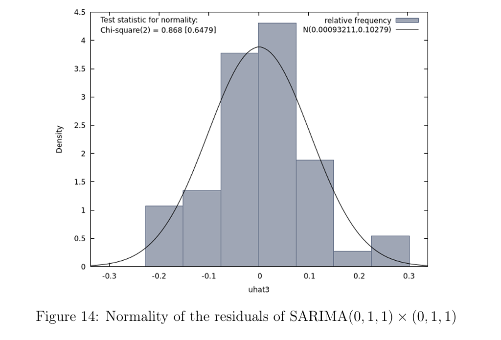
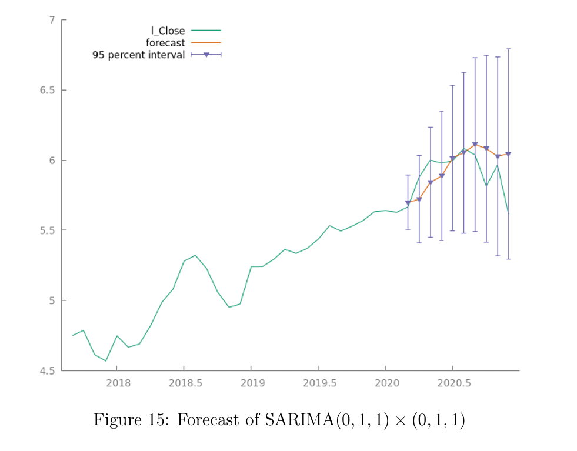

## 1. Introduction

While studying, I got really into data analysis - especially time series. This project is one I worked on using GRETL, where I used ARIME and SARIMA models to forecast sales.It was a great way to turn theory into something more hands-on and actually see how those models work in practice.

Feel free to check it out and see what insights I found!

## 2. Abstract

In this project my main goal is to use time series of interest to analyze and forecast. I have chosen monthly stock prices of a Polish video game developer, publisher and distributor CD Projekt S.A. Firstly, I will introduce data and tell a little bit about important dates which were affecting this time series. Later I will conclude if this time series can be considered as a representation of stationary process. Next I will analyze correlogram and also use automatic criteria in order to identify test models. Then I will estimate those models using the training set and also check them, that is establish if residuals of those models can be considered as a realization of white noise process and also I will check whether the residuals are normally distributed or not. Finally I will forecast using those models and I will compare them to the real values of the test set. At the end I will summarize my observations

## 3. Introducing the data
Let’s first have a look at our data. This series is containing monthly stock prices of CD Projekt S.A. from January 2015 to December 2020. The currency of those prices is in Polish currency PLN. PLN to EUR converter is 0.22 on the day 20 January 2021.

The company was founded in May 1994 by Marcin Iwiński and Michał Kiciński, but it debuted only in 2011 on the stock market as a result of collaboration with Optimus (the computer business which was on a verge of bankruptcy). The years before 2015 were 1 not the best for the company and the prices remained practically at the same very low value ( 7.00PLN). That’s why I am considering this time series starting from January 2015, because this is the most interesting period to analyze.

On May 2015 the company released The Witcher 3: Wild Hunt based on the book series made by Andrzej Sapkowski. But only after one year the company began to record growth. So what happened later? In May 2017 Netflix officially declared new series taking place in The Witcher world. The announcement of the series triggered an increase in the company’s stock prices, while after the announcement of the official cast (in October 2018), prices began to fall. It was related to the controversy surrounding the actors who, according to the fans, did not fit into the world created by Andrzej Sapkowski. However, after the series premiere, which was in December 2019, the company’s shares were still going up. In the December 2020 after releasing the most important game that was awaited by the whole gaming world, Cyberpunk 2077, prices fell sharply. Widespread criticism concerning technical underdevelopment, that caused numerous errors, despite many pre release assurances that a full-fledged product will be available on the market, caused the shake throughout investors.

The plot below contains those important dates.

Let’s now concentrate on analyzing our time series using tools that I learned during the course. Firstly, I will consider whether this time series is a representation of a stationary process or not.

## 4. Stationary process or not?

Looking at the plot of our time series we can conclude that this clearly is not a representation of a stationary process. There is a trend and also by looking at the correlogram of this time series we can see that.

So now what we need to do is to transform it in a way to get the stationary process. I have decided to consider this time series as a seasonal time series because during forecast I obtained better forecasts when I removed seasonal component. My first attempt to obtain stationary process was using first difference of my observed values and then the seasonal difference. But although the expected value was 0, the variance was not constant. The plot below shows this result.

Clearly, in the above plot we can see that the variance is increasing over time. That’s why now I am using log transformation to stabilize it and then both first and seasonal differences.

In this situation we can see that the mean is equal to 0 and we can assume that the variance is more or less constant. That’s why now, after all the transformations, this time series can be considered as a representation of a stationary process. So now we will consider correlogram of that transformed time series and also we will use automatic criteria in order to conclude test models.

## 5. Correlograms and Automatic criteria

Let’s now have a look at the information of our transformed data.

And now on the correlogram of our transformed data.

Looking at this information we need to think a little which models will be appropriate to consider later. Let’s look at partial auto-correlation function. We can see that the second coefficient is slightly different from zero. It can make sense to consider SARIMA(0,1,2)x(0,1,2). Let’s look at what automatic criteria is saying.

From what we can see I was right. So the models that I will consider will be SARIMA(0,1,2)x(0,1,2) and also SARIMA(2,1,2)x(2,1,2). Having in mind airline model I will also consider SARIMA(0,1,1)x(0,1,1).

## 6. Estimating and checking models

Firstly, let’s notice that we have 72 observations which will be divided into two sets: the training set and the test set. The training set will contain 62 observations and to the test set will belong last 10 observations. Now I will estimate those models using the training set  which contains dates from January 2015 to February 2020.

I will start my considerations with analyzing SARIMA(0,1,2)x(0,1,2).

## 6.1  SARIMA (0,1,2)x(0,1,2)

By creating the model SARIMA (0,1,2)x(0,1,2) from the training set we are getting the following:

Looking at p-value we can see that coefficient Theta_1 is significantly different from zero. Now let’s have a look at the correlogram of residuals to consider if residuals can be a representation of white noise process.

We can consider residuals to be a representation of white noise process because we can’t see coefficients that are significantly different from zero. Let’s also test if the residuals are normally distributed.

From this histogram we can conclude that the residuals are normally distributed. Then we can conclude that the residuals can be representation of Gaussian white noise process. So we checked assumptions that we needed to check to conclude if our model is correct. Now let’s try to forecast.

We can see that this model is quite good. It didn’t forecast too well but looking at the past values this forecasting is making sense. It predicted the drop down of stock prices at the moment of the biggest drop. Let’s remember that Root Mean Squared Error in this case is equal to 0.22675.

##  6.2 SARIMA (2,1,2)x(2,1,2)

Now we are considering SARIMA (2,1,2)x(2,1,2) and obtaining the following result.

We can see that most of the coefficients are not significantly different from zero. Let’s now look at the correlogram of residuals.

We can conclude that they are representation of white noise process, because there is no residual that is significantly different from zero. Let’s check normality of the residuals.

We can also see that those residuals are normally distributed (we can conclude that looking at p-value) so they are representing Gaussian white noise process. Now we use forecasting tools to get:

And we see that it again predicted the fall of the prices as the model before. Still not good, but satisfactory. Let’s keep in mind that Root Mean Squared Error equals 0.20448 (a bit better than the previous).

## 6.3 SARIMA(0,1,1)x(0,1,1)

Finally let’s consider now our last model, which is SARIMA (0,1,1)x(0,1,1). This is our result:

We can see that only one parameter, Theta_1, is significantly different from zero. We are seeing it looking at p-value. Let’s also give a look at the correlogram of the residuals.

In the correlogram we can see that there are coefficients which are significantly different from zero. So we probably can’t say that the residuals of this model can be considered as a realization of a white noise process. Let’s also have a look at histogram to check normality of the residuals.

We can see that p-value, equal to 06479, is saying to us that the residuals are normally distributed. But anyway let’s look at a forecast.

It looks like this one is the best. There is a moment when the predicted values are practically the same as the real ones. Also Root Mean Squared Error is equal to 0.1805.

## 7. Summary

From the analysis we did, we get very interesting results that will be presented here. First of all let’s compare the plots of our forecasts.

We can see that the first two models are really alike, because they forecast in a very  similar way. The third model is the best because at some point the predicted values are practically the same as real stock prices. Let’s also see the comparison of Root Mean Squared Error. The result is presented in the following table:

Looking at the plots and taking the minimum of presented Root Mean Squared Errors, we can conclude that the best model is SARIMA(011) (011), though the correlogram of the residuals is not truly presenting a realization of a white noise process. The next best model is SARIMA(212) (212). Moreover the residuals of this model are realization of a white noise process.
