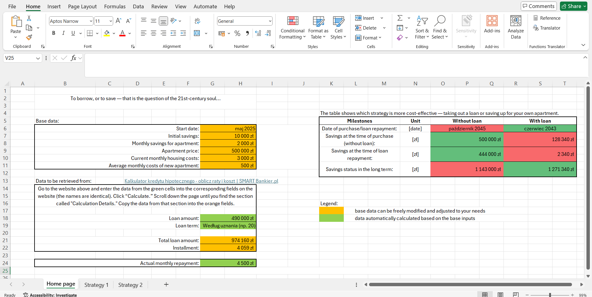
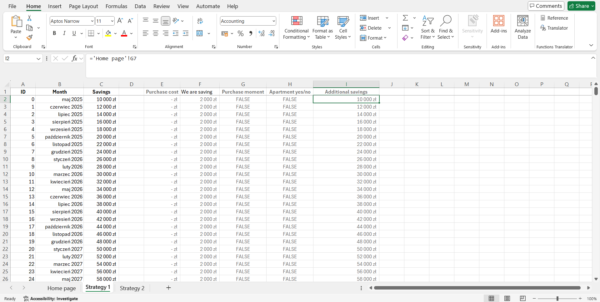
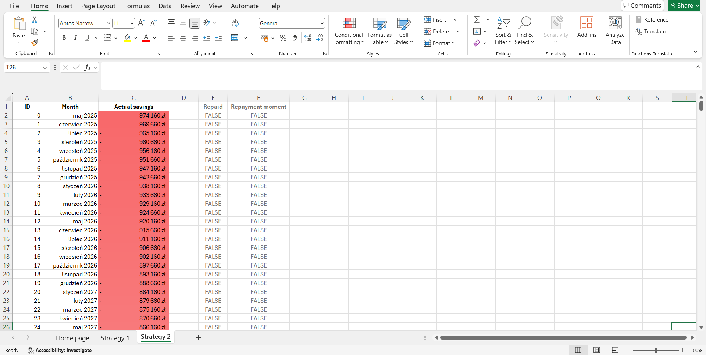

## Summary
The housing situation in Poland is far from optimistic. Rising property prices, surging inflation, and an unstable job market can shake even the most stoic thirty-something who thought nothing in life could surprise him anymore. Now, however, he’s beginning to wonder whether he can afford an apartment. And if so, under what conditions?

The answer can be found below. I have prepared an Excel file* presenting two strategies related to purchasing a property (with or without a mortgage). It includes approximate calculations and comparisons of both strategies.

*The tool itself is not financial advice. It is a simple simulation designed to test potential outcomes based on your own data. Feel free to explore it!

## Excel – Description

The Excel file included in the portfolio presents two strategies for purchasing an apartment (with or without a mortgage) and compares them.

- Sheet 1 – Home Page: Contains basic input data for the calculations and a summary of the results for both strategies.

- Sheet 2 – Strategy 1: Involves saving money for several years and then purchasing an apartment.

- Sheet 3 – Strategy 2: Involves taking out a mortgage for x years, buying an apartment, and repaying the loan.

## Conclusions:

- Strategy 1: Requires a longer wait before purchasing a home and entails higher current rental costs. However, once the property is bought, there’s no need to worry about interest payments.

- Strategy 2: Allows for a quicker purchase, avoiding high rental expenses, but comes with interest costs. The person choosing this strategy can enjoy owning their own home right away.

Both strategies have their pros and cons—the key is to choose the one best suited to your personal circumstances. The interactive summary helps track changes in real time as users adjust the parameters of each strategy.

