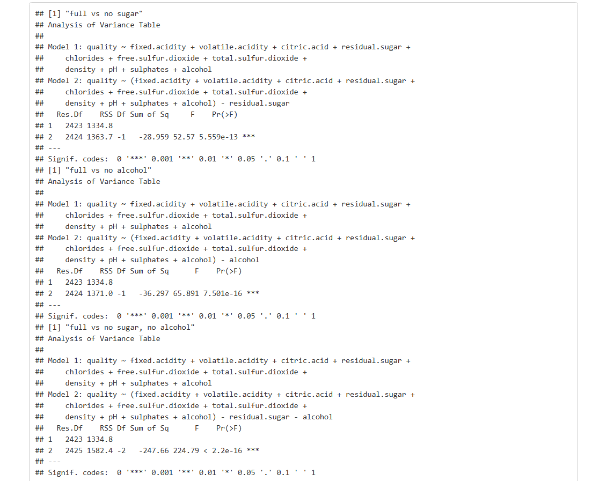
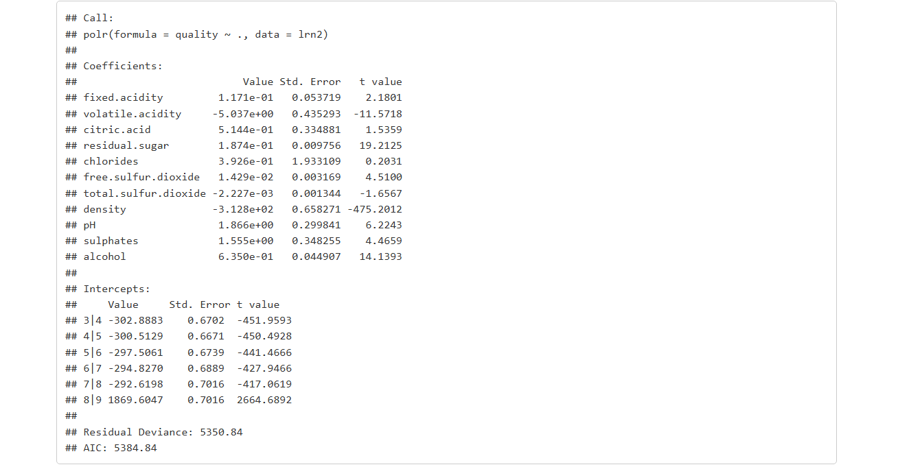

## 1. Analysis of wines

The dataset we’ll be working with comes from [kaggle.com](https://www.kaggle.com/datasets/shelvigarg/wine-quality-dataset/data) and includes info on both red and white "Vinho Verde" wines — a variety from northern Portugal.

In this project, we’re going to explore how well *linear regression* can model the data.

*Linear regression* is basically a way to figure out how one variable (like wine quality) is influenced by others (like acidity, alcohol content, etc.). We try to draw a line through the data points that best captures the trend or relationship between them.

But before we dive into any analysis, let’s load up the necessary libraries so that everything runs smoothly.

```{r,message = FALSE, warning = FALSE}
library(car)
library(corrplot)
library(dplyr)
library(faraway)
library(lmtest)
library(MASS)
library(nortest)
library(RColorBrewer)
```

## 2. The Data – Structure and Classification

Let's load the winequalityN.csv file and take a quick look at the structure of the dataset.

```{r}
wine <- read.csv("C:\\Users\\Nikola\\Documents\\Nikola Chmielewska\\R\\Datasets\\winequalityN.csv")
str(wine)
```

<p align="center">

</p>

```{r}
unique(wine$type)
```

<p align="center">

</p>

From the command above, we can see that the dataset includes information on two wine types: red and white.

Now, let’s break down the variables included in the dataset to better understand what we’re working with:

| Name | Description | 
|:--------|:--------|
| type | Type of wine (white or red) |
| fixed.acidity |	Fixed acidity |
| volatile acidity | Volatile acidity |
| citric acid |	Citric acid |
| residual sugar | Residual sugar |
| chlorides |	Chlorides |
| free sulfur dioxide | Free sulfur dioxide |
| total sulfur dioxide | Total sulfur dioxide |
| density |	Density |
| pH – potential of hydrogen |	Acidity/basicity (pH level) |
| sulphates | Sulphates |
| alcohol | Alcohol content |
| quality |	Wine quality rating |

To get a better feel for the data, let’s look at a summary:

```{r}
summary(wine)
```

<p align="center">

</p>

Before diving in deeper, let’s also check whether there are any missing values in the dataset.

```{r}
(sapply(wine, function(x) {sum(is.na(x))}))
```

<p align="center">

</p>

As we can see, there are some NA values in the table. Since they represent only a small portion of the data, we’ll go ahead and drop those rows. Missing data could affect the quality of our analysis later on, so it’s better to clean it up now.

```{r}
wine_clean <- na.omit(wine) #deleting rows containing NA values
```

Once we remove the rows with missing values, let’s take another look at our updated dataset.

```{r}
(sapply(wine_clean, function(x) {sum(is.na(x))}))
```

<p align="center">

</p>

Now everything looks good — no missing data, so our dataset is ready to go!

In this dataset, the variable we’re trying to predict is quality, which represents the wine’s rating. All the other variables are independent (predictor) variables, and they’re numerical in nature. As for quality, it can actually be seen in two ways: either as a continuous numeric variable or as an ordinal categorical variable (since it reflects a quality rating).

In our analysis, we’ll first treat quality as a numeric variable when applying linear regression. But later on, when we build a proportional odds model, we’ll treat it as an ordinal categorical variable. Also, for hypothesis testing, we’ll be using a significance level of *α = 0.05*.

### 2.1. Splitting the Dataset

We’re going to start by splitting the dataset based on the wine type — white and red. For this analysis, we’ll keep things simple and focus only on white wine. If you want, you can run a similar analysis later for red wine by following the same steps.

```{r}
white_wine <- subset(wine_clean, type == "white")
```

Next, we’ll drop any text-based columns since we’re only interested in working with numerical data for this part of the project.

```{r}
white_numeric <- white_wine[sapply(white_wine, is.numeric)]
```

Now let’s create a few helper variables that’ll make it easier to divide the dataset into three separate subsets.

```{r}
N <- nrow(white_numeric)
I <- (1:N)
```

Time to randomly generate the indexes for the split.

```{r}
set.seed(300)
I_l <- sample.int(N, size = round(N/2)) #50% of the data
I_v <- sample(setdiff(I, I_l), size = round(N/4)) #25% of the data
I_t <- setdiff(setdiff(I, I_l), I_v) #25% of the data
```

We’ll use those indexes to create three data subsets: a training set, a validation set, and a test set — with 50%, 25%, and 25% of the data, respectively.

```{r}
lrn <- white_numeric[I_l,] #training set
val <- white_numeric[I_v,] #validation set
tst <- white_numeric[I_t,] #test set
```

And just like that, we’ve split our data into three parts — all set for the next steps in the analysis.

### 2.2 Variable Correlation

Before jumping into building a linear regression model, let’s first take a look at the correlation heatmap for the variables in our training set.

```{r}
white_matrix <- cor(lrn)
corrplot(white_matrix, type = "lower")
```

<p align="center">

</p>

*Correlation* tells us how two variables move together. The Pearson correlation coefficient (which ranges from -1 to 1) is a handy number that shows us the strength and direction of the relationship.

A positive value means both variables tend to increase together, while a negative value means that as one goes up, the other tends to go down. The closer the value is to either -1 or 1, the stronger the relationship. If it’s closer to 0, it usually means there’s not much of a connection.

From the plot, we can see that ‘alcohol’ and ‘density’ show the strongest relationships with wine ‘quality’ — alcohol is positively correlated, and density is negatively correlated.

It’s also worth noting that ‘density’ is strongly tied to ‘residual sugar’, and there’s also a clear link between ‘alcohol’ and ‘density’. Based on that, we’ll try building models that exclude either ‘residual sugar’ or ‘alcohol’ (or both) to see how things change.

We’ll also try out *Principal Component Analysis (PCA)* to compare this approach with standard regression.

*PCA* is a technique that transforms the original variables into a new set of uncorrelated variables (called principal components), which can make our models cleaner and sometimes more effective.

## 3. Linear Regression Models
### 3.1. Basic Models

We’re going to build several linear regression models where we try to predict wine ‘quality’ using different sets of features:

- Full model: uses all variables from the training set.
- No sugar: drops the ‘residual sugar’ variable.
- No alcohol: drops the ‘alcohol’ variable.
- No sugar & no alcohol: drops both ‘residual sugar’ and ‘alcohol’.

To make our lives easier, we’ll create a function that builds each of these models for us.

```{r}
models <<- list()
countM  = 0
add_model = function(name, model, ispca){
  models <<- append(models, list(name, model, ispca))
  countM <<- countM + 1
}
get_name  = function(index){models[[index*3-3+1]]}
get_model = function(index){models[[index*3-3+2]]}
is_pca    = function(index){models[[index*3-3+3]]}

add_model('full',                 lm(quality ~ .,                            data = lrn), FALSE)
add_model('no sugar',             lm(quality ~ . - residual.sugar,           data = lrn), FALSE)
add_model('no alcohol',           lm(quality ~ .                  - alcohol, data = lrn), FALSE)
add_model('no sugar, no alcohol', lm(quality ~ . - residual.sugar - alcohol, data = lrn), FALSE)
```

Then we’ll display a summary for each model, in the order listed above.

```{r}
for(i in 1:countM){
  print(get_name(i))
  print(summary(get_model(i)))
}
```

<p align="center">

</p>

<p align="center">

</p>

<p align="center">

</p>

<p align="center">

</p>

Just by glancing at the summaries, it’s pretty obvious that the last model (the one without both sugar and alcohol) performs the worst — especially when you look at the adjusted R-squared, which is way lower than in the other models. To double-check whether the smaller models are valid, we’ll run an ANOVA test.

As a quick reminder: adjusted R-squared tells us how well the model explains the data. Values closer to zero mean the model doesn’t do a great job.

#### 3.1.1 ANOVA

ANOVA (Analysis of Variance) is a statistical method used to compare means across different groups — basically, it helps us see if the differences between models are statistically significant. It can tell us if one model is actually better than another or if the differences are just noise.

Here’s the hypothesis setup for our test:

- H<sub>0</sub>: The smaller model is good enough.
- H<sub>1</sub>: The smaller model doesn’t fit well.

```{r}
for(i in 2:countM){
  print(paste(get_name(1), 'vs', get_name(i), sep=' '))
  print(anova(get_model(1), get_model(i)))
}
```

<p align="center">

</p>

From the test results, at a significance level of α = 0.05, we can reject H₀ — meaning the smaller models (where we removed variables strongly correlated with density) don’t perform well enough.

#### 3.1.2. Backward Elimination + ANOVA

Now let’s try backward elimination. This method involves gradually removing the least important variables from the model, one at a time. The goal is to end up with a simpler model that still performs well.

We’ll start with the full model (the one with all variables), and begin eliminating features step by step.

```{r}
elim <- add_model('no acid', lm(quality ~ . - citric.acid, data = lrn), FALSE)
anova(get_model(1), get_model(countM))
```

<p align="center">

</p>

```{r}
summary(get_model(countM))
```

<p align="center">

</p>

After each removal, we’ll use ANOVA to check if the simpler model still holds up. At a significance level of *α = 0.05*, we found that we can’t reject the null hypothesis — which means the simplified models are still acceptable.

```{r}
add_model('no acid, no chlorides', lm(quality ~ . - citric.acid - chlorides, data = lrn), FALSE)
anova(get_model(1), get_model(countM))
```

<p align="center">

</p>

```{r}
summary(get_model(countM))
```

<p align="center">

</p>

```{r}
add_model('no acid, no chlorides, no totalsulf', lm(quality ~ . - citric.acid - chlorides - total.sulfur.dioxide, data = lrn), FALSE)
anova(get_model(1), get_model(countM))
```

<p align="center">

</p>

```{r}
summary(get_model(countM))
```

<p align="center">

</p>

In the next couple of models, the same thing happens. At this point, the remaining variables are statistically significant, so it doesn’t make sense to remove any more — we’d just end up weakening the model.

### 3.2. Principal Component Analysis (PCA)

To explore an alternative modeling approach, we’ll now use Principal Component Analysis (PCA).

```{r}
par(mfrow = c(1, 2))

pca     <- prcomp(lrn[1:11], scale. = TRUE)
pca_var <- pca$sdev^2
plot(pca_var / sum(pca_var), xlab = "Principal Components",
 ylab = "Explained variance ratio",
 type = "b")

pca_data <- data.frame(quality = lrn$quality, pca$x)

corrplot(cor(pca_data), type = "lower")
```

<p align="center">

</p>

Looking at the plot, we can see that two of the components fall below the significance threshold of *α = 0.05*, suggesting they don’t contribute much to the model. The adjacent chart also confirms that all the new variables (except ‘quality’) are uncorrelated — which is one of the key benefits of PCA. We'll also apply backward elimination here to remove those components that don’t seem to matter much.

### 3.3. Backward Elimination with PCA and ANOVA

We’ll start by building a PCA-based model and gradually eliminate components one by one — checking at each step whether the reduced model still holds up.

```{r}
pca_base <- add_model('pca', lm(quality ~ ., data = pca_data), TRUE)
summary(get_model(countM))
```

<p align="center">

</p>

```{r}
add_model('pca no pc6', lm(quality ~ . - PC6, data = pca_data), TRUE)
anova(get_model(pca_base), get_model(countM))
```

<p align="center">

</p>

```{r}
summary(get_model(countM))
```

<p align="center">

</p>

After removing the component ‘PC6’, the model still performs well — in fact, we can’t reject the null hypothesis at the *α = 0.05* level, meaning the reduced model is adequate. Next, we try removing ‘PC7’ as well.

```{r}
add_model('pca no pc6, no pc7', lm(quality ~ . - PC6 - PC7, data = pca_data), TRUE)
anova(get_model(pca_base), get_model(countM))
```

<p align="center">

</p>

```{r}
summary(get_model(countM))
```

<p align="center">

</p>

Again, the model remains adequate. Since we’re still unable to reject null hypothesis, we conclude that both PC6 and PC7 are unnecessary. But beyond this point, removing more components doesn’t make sense — the remaining ones are clearly significant.

### 3.4. Model Diagnostics

Now it’s time to dive into the diagnostics for our models. We’ll look at Cook’s distance to identify and remove any outliers, then rebuild the models without those points. We’ll also calculate what percentage of our data points are considered influential and inspect residual plots for further insight.

A quick recap: *Cook’s distance* is a measure used in regression analysis to identify observations that have a large influence on the fitted model.

#### 3.4.1. Outlier Detection

We’ll create a helper function to automate the process of computing Cook’s distance and generating the necessary plots.

As a rule of thumb, any observation with a Cook’s distance greater than or equal to 1 is considered influential.

```{r}
cook_base = countM

cook_statistics = function(name, model, ispca){
  cook <- cooks.distance(model)
  plot(cook, xlab = "Indexes",  ylab = paste("Distance(", name, ")"))
  if(max(cook) >= 1){
    name <- paste('cook', name, sep = ' ')
    while(max(cook) >= 1){
      model <- update(model, subset = (cook < max(cook)))
      cook  <- cooks.distance(model)
    }
    add_model(name, model, ispca)
  }
}

layout(matrix(c(1,2,3,4,5,6,7,8,9,10), 2, 5, byrow = TRUE))

for(i in 1:cook_base){
  name  <- get_name(i)
  model <- get_model(i)
  cook_statistics(name, model, is_pca(i))
}

mtext("Cook’s distance", side=3, outer=TRUE, line=-3)
```

<p align="center">

</p>

Looking at the plots, we see that the ‘no sugar’, ‘no alcohol’, and ‘no sugar, no alcohol’ models don’t contain any outliers — all Cook’s distances are below 1. Other models do contain outliers, so we automatically rebuild those models after removing the influential points. In each case, no more than one outlier was detected.

#### 3.4.2. Influential Observations

Next, we’ll focus on influential points. We'll generate plots showing where the threshold lies for each model, to better visualize which observations cross the line.

To handle the large number of models (we’re already up to 17), we’ll write a function that automates this step too.

```{r}
par(mfrow = c(9, 3))

leverages <- mapply(function(index){
    name  <- get_name(index)
    model <- get_model(index)
    lev   <- hat(model.matrix(model))
    p <- (index - 1) %% 3
    q <- ifelse((index - 1) %% 6 >= 3, 0, 1)
    par(fig = c(1/3 * p,1/3 + 1/3 * p, 0.5 * q, 0.5 + 0.5 * q), new = (index %% 6 != 1))
    plot(lev, xlab = "Indexes", ylab = "Influential Observations", main = name)
    abline(h = 2 * sum(lev) / nrow(model$model), col = 'red')
    lev
  }, 1:countM)
```

<p align="center">

</p>

<p align="center">

</p>

After removing outliers, the resulting models have much cleaner plots. However, the visuals themselves aren’t particularly informative on their own — so we’ll compute the percentage of influential observations for each model and present the results in a table.

```{r}
data.frame(names = mapply(get_name, 1:countM), 
           percentages = mapply(function(index){ 
                           model <- get_model(index)
                           lev   <- leverages[[index]]
                           paste(round(sum( ifelse(lev > 2 * sum(lev) / nrow(model$model), 1, 0)) / nrow(model$model) * 100, 2), '%')
                         }, 1:countM))
```

<p align="center">

</p>

There’s a clear difference in how these influential observations are distributed across the various models.

#### 3.4.3. Residual Plots

Let’s also take a look at the residual plots for all models.

```{r}
par(mfrow = c(ceiling(countM / 4), 4))

for(i in 1:countM){
  model <- get_model(i)
  p <- (i - 1) %% 4
  q <- ifelse((i - 1) %% 8 >= 4, 0, 1)
  par(fig = c(1/4 * p, 1/4 + 1/4 * p, 0.5 * q, 0.5 + 0.5 * q), new = (i %% 8 != 1))
  plot(model$fit, model$res, xlab="Fitted", ylab="Residuals", main = get_name(i))
  abline(h = 0, col = 'red')}
```

<p align="center">

</p>

<p align="center">

</p>

In each model, we see some deviation of residuals from the fitted values. That said, the plots are fairly similar overall. Outliers identified earlier using Cook’s distance have already been removed, as shown by the differences between the original and updated models. Only the residual plots for ‘no alcohol’ and ‘no sugar, no alcohol’ stand out as looking quite different from the others.

### 3.5. Assumptions of Linear Regression

#### 3.5.1. Normality of Residuals

First, let’s inspect the residual plots.

```{r}
par(mfrow = c(ceiling(countM / 4), 4))

for(i in 1:countM){
  model <- get_model(i)
  p <- (i - 1) %% 4
  q <- ifelse((i - 1) %% 8 >= 4, 0, 1)
  par(fig = c(1/4 * p, 1/4 + 1/4 * p, 0.5 * q, 0.5 + 0.5 * q), new = (i %% 8 != 1))
  qqnorm(rstudent(model), xlab = "Theoretical quantiles", ylab = "Studentized residuals", main = get_name(i))
  abline(0,1)
}
```

<p align="center">

</p>

<p align="center">

</p>

We can see that the residuals aren’t perfectly normally distributed — but the deviation is minor, and because we’re working with a large sample size, it’s not a major concern. Still, let’s formally test this using the Shapiro–Wilk test.

Here are the hypotheses:

H<sub>0</sub>: Residuals are normally distributed

H<sub>1</sub>: Residuals are not normally distributed

```{r}
data.frame("Model's name" = mapply(get_name, 1:countM),
           "p-value" = mapply(function(i){ shapiro.test(get_model(i)$residuals)$p.value }, 1:countM)) 
```

<p align="center">

</p>

According to the test results, we must reject H₀ — suggesting that none of the models have normally distributed residuals. This may seem contradictory to what the plots showed, but large sample sizes can make even small deviations statistically significant, which is a known limitation of such tests.

#### 3.5.2. Homoscedasticity (Constant Variance)

To test for constant variance, we’ll create residual-vs-fitted plots for each model.

```{r}
par(mfrow = c(ceiling(countM / 4), 4))

for(i in 1:countM){
  model <- get_model(i)
  p <- (i - 1) %% 4
  q <- ifelse((i - 1) %% 8 >= 4, 0, 1)
  par(fig = c(1/4 * p, 1/4 + 1/4 * p, 0.5 * q, 0.5 + 0.5 * q), new = (i %% 8 != 1))
  plot(model$fit, model$res, xlab = "Zmienne dopasowane", ylab = "Zmienne resztowe", main = get_name(i))
  abline(h = 0, col = 'red')
}
```

<p align="center">

</p>

<p align="center">

</p>

We’ll also apply the Goldfeld–Quandt test, which formally checks for heteroscedasticity. Here are the hypotheses:

H<sub>0</sub>: Residuals have constant variance

H<sub>1</sub>: Residuals do not have constant variance

```{r}
data.frame("Models name" = mapply(get_name, 1:countM),
           "p-value" = mapply(function(i){ gqtest(get_model(i))$p.value }, 1:countM)) 
```

<p align="center">

</p>

Across all models, we fail to reject H₀ at the α = 0.05 level. This suggests that the assumption of constant variance holds.

#### 3.5.3. Residual Independence

To check whether residuals are correlated, we use the Durbin–Watson test. Hypotheses:

H<sub>0</sub>: Residuals are not autocorrelated

H<sub>1</sub>: Residuals are autocorrelated

```{r}
data.frame("Model's name" = mapply(get_name, 1:countM),
           "p-value" = mapply(function(i){ durbinWatsonTest(get_model(i))$p }, 1:countM)) 
```

<p align="center">

</p>

Test results show no reason to reject H<sub>0</sub> — in other words, residuals appear to be uncorrelated in all our models.

### 3.6. Multicollinearity of Predictors

To assess multicollinearity, we’ll use the Variance Inflation Factor (VIF).

```{r}
VIF = function(i){
  data.frame("Name" = get_name(i), t(vif(get_model(i))))
}
```

This simple test, based on R² values, tells us how much a variable’s variance is inflated due to correlations with other predictors.

In every model, the highest VIF values appear for ‘density’, ‘residual sugar’, and ‘alcohol’. These are clearly the most collinear variables — though the issue isn’t extreme across the dataset. Models that exclude these variables naturally show lower multicollinearity.

### 3.7. Goodness-of-Fit Measures

Before selecting the best model, let’s examine how well each model fits the data using standard fit metrics.

```{r}
data.frame("Model's name" = mapply(get_name, 1:countM),
           "Adjusted R-squared"  = mapply(function(index){summary(get_model(index))$adj.r.squared}, 1:countM),
           "Estimator of error variance" = mapply(function(index){summary(get_model(index))$sigma}, 1:countM),
           check.names = FALSE)
```

<p align="center">

</p>

Looking at the results, if we were to base our choice solely on the adjusted R-squared, the best model would be ‘cook no acid, no chlorides, no totalsulf’. However, our selection will be based on the Residual Sum of Squares (RSS) instead.

### 3.8. Best Model Selection Based on RSS and Model Evaluation

We’ll create a function that returns the following for each model: the model name, the residual sum of squares between the validation sample and predicted values, the percentage of correct classifications, and the percentage of classifications within ±1 of the true value.

```{r}
pca_val <- as.data.frame(predict(pca, newdata = val[1:11]))
pca_tst <- as.data.frame(predict(pca, newdata = tst[1:11]))
```

```{r}
prediction_summary <- data.frame(matrix(ncol = 4, nrow = 0, dimnames = list(NULL, c("Nazwa", "RSS", "Odsetek popr","Odsetek róż"))))
```

```{r}
make_prediction = function(index, non_pca, iff_pca){
  name  <- get_name(index)
  model <- get_model(index)
  if(is_pca(index)){
    prediction <- round(predict(model, iff_pca))
  }else{
    prediction <- round(predict(model, non_pca[1:11]))
  }
  prediction_summary[nrow(prediction_summary) + 1,] <<- c(name,
    sum((prediction - non_pca[12])^2),
    sum(non_pca[12] == prediction, na.rm = TRUE) / nrow(non_pca[12]) * 100,
    sum(abs(non_pca[12] - prediction) <= 1)/ nrow(non_pca[12]) * 100)
}
```

```{r}
for(i in 1:countM){ make_prediction(i, val, pca_val) }
```

```{r}
prediction_summary
```

<p align="center">

</p>

From the generated table, we observe that the models with the lowest residual sum of squares — and therefore the best by this metric — are ‘pca no pc6’ and ‘pca no pc6, no pc7’. However, since ‘pca no pc6’ has a higher rate of correct classifications, we choose it as the final model for further testing.

Let’s now evaluate the performance of this chosen model.

```{r}
prediction_summary <- data.frame(matrix(ncol = 4, nrow = 0, dimnames = list(NULL, c("Name", "RSS", "Percentage of correct predictions","Percentage of differences"))))

make_prediction(9, tst, pca_tst)

prediction_summary

```

<p align="center">

</p>

Although it’s not outstanding, the model performs decently on the test set, correctly predicting over half of the classifications. We can conclude that this is the best linear regression model we’ve built — but it's also clear that linear regression itself comes with considerable prediction error.

## 4. Proportional Odds Model

To adapt the quality variable into a categorical format, we’ll build a proportional odds (ordinal logistic regression) model.

```{r}
wine1 <- white_numeric
wine1$quality <- factor(wine1$quality)
```

We’ll again split the data into the same three subsets as before.

```{r}
lrn2 <- wine1[I_l,]
val2 <- wine1[I_v,]
tst2 <- wine1[I_t,]
```

The initial model is constructed as follows:

```{r}
g.plr <- polr(quality ~ ., data = lrn2)
g.plr
```

<p align="center">

</p>

Now, let’s look at the model summary.

```{r}
summary(g.plr)
```

<p align="center">

</p>

We use the predict() function to make predictions with this model.

```{r}
pr_log1 <- predict(g.plr, val2[,1:11], type="class")

val21 <- as.numeric(val2$quality)
pr_log11 <- as.numeric(pr_log1)
```

Then we compute the residual sum of squares.

```{r}
sum((pr_log11-val21)^2)
```

<p align="center">

</p>

We can see that the model is average, so we’ll try to improve it. We’ll simplify the model using the step function.

```{r}
o_lr = step(g.plr)
```

<p align="center">

</p>

The model turns out to be mediocre, so we attempt to improve it. We simplify the model using the step() function to minimize the AIC — a criterion that estimates the information lost by a model. The smaller the AIC, the better the model in terms of avoiding overfitting or underfitting.

Let’s look at the summary of the reduced model.

```{r}
summary(o_lr)
```

<p align="center">

</p>

```{r}
anova(g.plr,o_lr)
```

<p align="center">

</p>

We see that this smaller model is statistically justified. However, when we recalculate the residual sum of squares…

```{r}
pr_log2<-predict(o_lr, val2[,1:11],type="class")

val21<- as.numeric(val2$quality)
pr_log12 <- as.numeric(pr_log2)
sum((pr_log12-val21)^2)
```

<p align="center">

</p>

…it turns out to be larger than for the full model. So, based on this criterion, the simplified model is not better. In fact, neither of the proportional odds models outperform the best linear regression model we selected earlier.

## 5. Summary

In this project, we constructed 17 linear regression models and 2 proportional odds models.

Among them, the linear regression model selected for final testing produced the lowest residual sum of squares. It also performed well on the test set, correctly classifying over half of the values — indicating that, within our modeling scope, it is the most accurate model we built.

Of course, additional models could be developed by excluding further outliers or refining feature selection. However, we chose to focus only on a limited number of models. Still, our findings suggest that linear regression is not an ideal modeling technique for this dataset, as it exhibits significant limitations in predictive accuracy.
