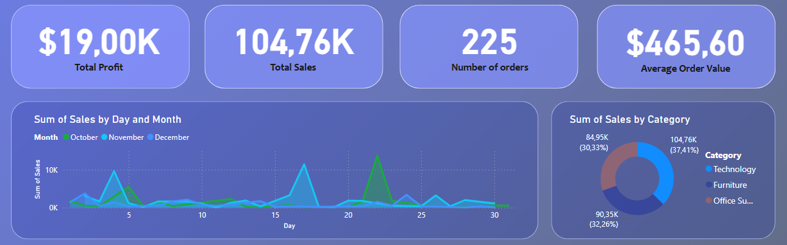
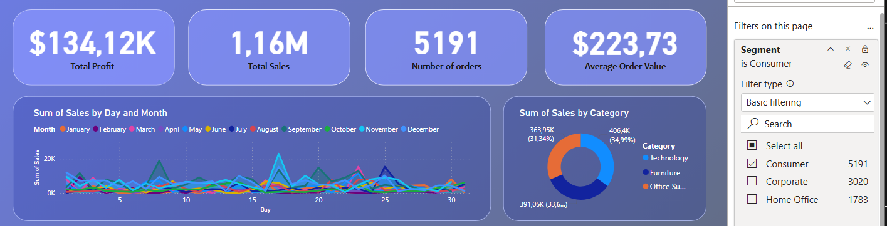
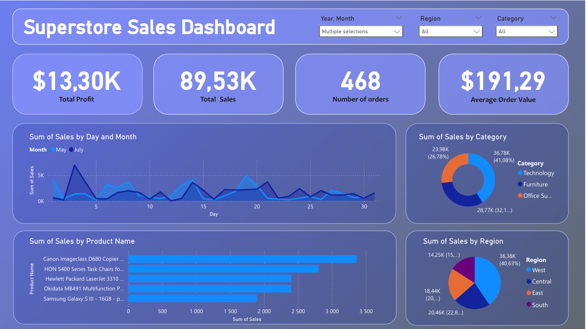

# Project: Sales Dashboard - Superstore Dataset

## 1. Goal

The goal of this project was to design an interactive sales dashboard that makes it easy to analyze revenue, profit, number of orders, and average order value. By adjusting the selection criteria, users can quickly drill down into the data and get the insights they need to make smart, fast business decisions.

## 2. Dataset

- **Source**: [Superstore Dataset - Kaggle](https://www.kaggle.com/datasets/vivek468/superstore-dataset-final) - dataset containing Sales & Profits of a Superstore
- **Data size**: ~10 000 records
- **Main variables in the dataset**: Order ID, Order Date, Region, Category, Sales, Profit

## 3. What I did

- Cleaned and transformed the raw data
- Calculated main values like: Total Profit, Total Sales, Profit Margin, Average Order Value, Number of Orders,
- Designed a dashboard withcharts, filters by Date, Region and Category and a clean layout
- Created visualisations like line charts, bar charts, pie charts and top 5 product ranking

## 4. Insights

- **Technology drives the highest revenue**

Technology is the top-performing product category in terms of revenue, especially in Q4, likely due to seasonal demand and higher unit prices.

- **Customer segment has the most orders but lower value**
  
Customer segment has the highest order count but lower Average Order Value than Corporate or Home Office segment.

## 5. Outcome

A clean, user-friendly dashboard that supports fast, intuitive analysis of sales data. The [roject demonstrates skills in data wrangling, use of DAX and dashboard design using Power BI.

## 6. Visualization

Feel free to explore my dashboard in Power BI file that you can find here: [Sales Dashboard - Superstore Dataset](https://github.com/NicoleHoppy/Projects/blob/main/Sales%20Dashboard%20-%20Superstore%20Dataset/Power%20BI%20-%20Sales%20Dashboard.pbix)

